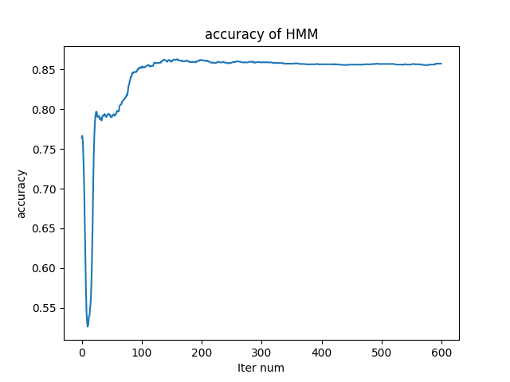
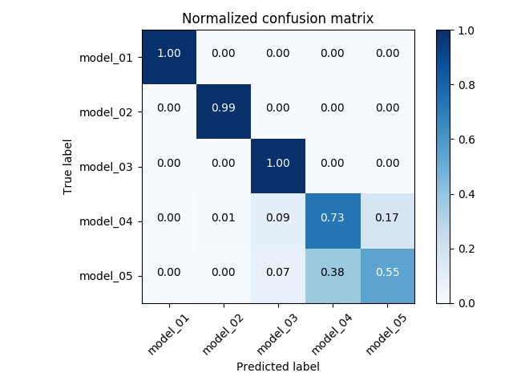

# DSP hw1

<h1 align = "right"><font size = "1">學號：b05902031, 系級：資工三, 姓名：謝議霆</font></h1>

## Environment

* Linux 4.17.11-arch1(CSIE Work station)
* with std = c++98

## Execution

```bash
// In hw1_b05902031/
make
./train [iteration] [model_init.txt] [seq_model_0x.txt] model_0x.txt
./test [modellist.txt] [testing_data1.txt] result1.txt
```

## Summary

### Training

* For each sequence, we can calculate a new **initial, transition, and observation** value.
* For computing with single sequence, first, we need to run a forward algorithm, which can calculate an ```alpha[50][6]``` array, the sum of probability of every path to a target state with the observation. And a backward algorithm, which can calculate an ```beta[50][6]``` array, the sum of probability of every path from a target state to the end with the observation.
* Then, we want to compute the probability of a state in target time. we can just element wise multiply ```alpha``` and ```beta``` and normalize each row and get ```gamma[50][6]```.
* Last, we need to compute the probability of all the edge from time $t$ to $t+1$ and from state $i$ to $j$. Thus, the probability an edge from $t$ to $t+1$ and from state $i$ to $j$ will be $alpha[t][i] \times transition[i][j] \times observation[j][time\ t+1\ in\ sequence] \times beta[t+1][j]$. After normalizing for each time, we got ```epsilon[50][6][6]```.
* After all the calculation above, we can determine a new model with
  * Initial : ```gamma[0]```
  * Transitoin : ```Transition[i][j] = sum(state i to state j in every time) / sum(prob of state i in every time) = sum(epsilon[0:50][i][j])/sum(gamma[0:50][i])```
  * Observation : ```observation[i][j] = sum(prob of state i that observe j) = sum(gamma[0:50 which observe j][i]) / sum(gamma[0:50][i])```
* Each sequence can determine a new model, so I update with the average of 10000 models according to the different sequences as one iteration.

### Testing

* In testing, we need to determine a target sequence belongs to which models. For one model, we can find out a state path with maximum probability. Pick the maximal probability among five model.

## Analysis

### Accuracy vs Iteration & Confusion matrix

| Accuracy             | Confusion matrix         |
| -------------------- | ------------------------ |
|  |  |

* According to the matrix, model4 and model5 may be confused. As the model is kinds of probability distribution, we can calculate the KL divergence between two model. ```KL(model_a,model_b) = KL(transition_a,transition_b)+KL(observation_a,observation_b)```
* ```KL(model5,model4)=26.366498550, KL(model5,model3)=38.745679928020294, KL(model5,model2)=61.95698215325713, KL(model5,model1)=63.439502773496784```, The distribution of model5 and model4 is the most similar as we can also see in the confusion matrix.
* * ```KL(model4,model5)=24.959332784000328, KL(model4,model3)=13.259912300454893, KL(model4,model2)=59.181746824642865, KL(model4,model1)=59.437558236294635```, which is also correspond to the confusion matrix.
